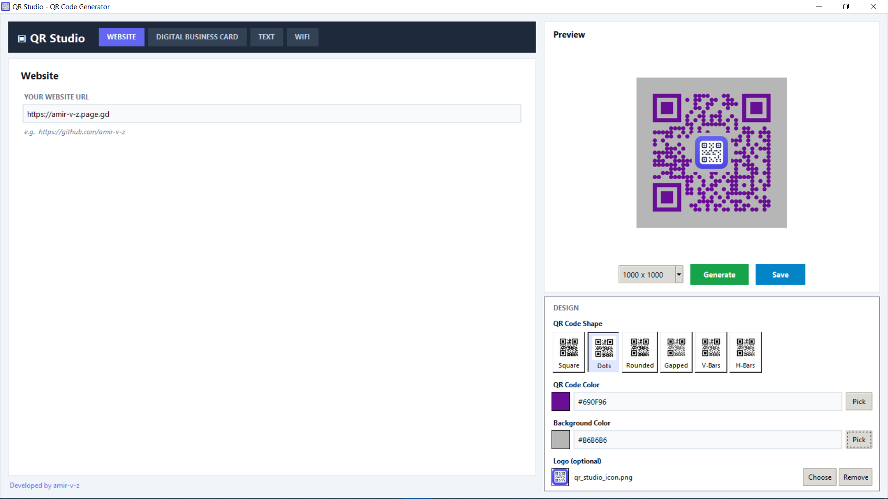
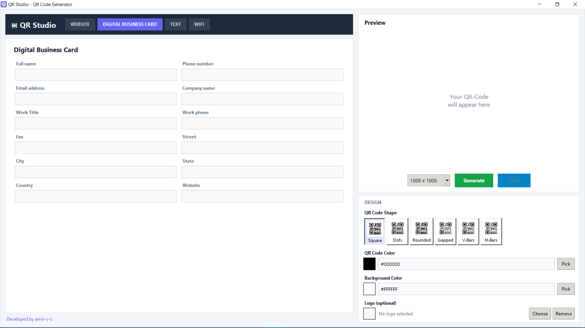
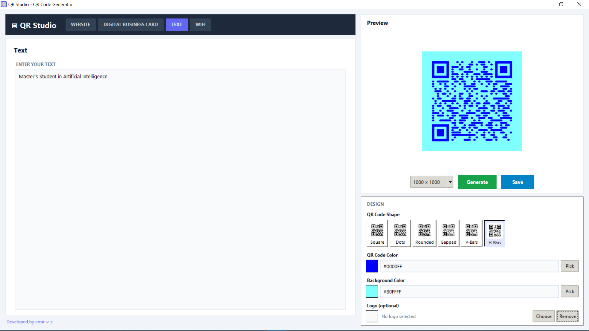
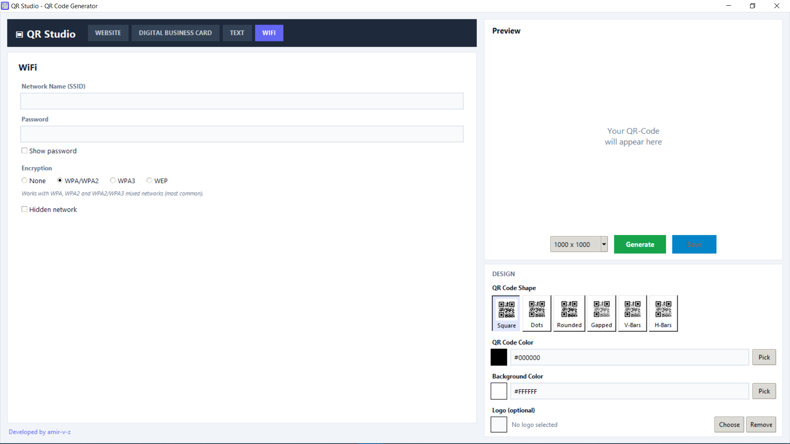

### QR Studio

# This EXE file helps you easily create and customize your own QR code.

## Screenshots of the program

### Website Page

### Digital card Page

### Text Page

### Wifi Page

#
> *__If you enjoyed...__*

> *__Don't forget to give stars  please 😉🙏🏻__*